<h1> Electricitat i Electrònica </h1>

<h3> Fonaments físics de l'electricitat </h3>
L'**electricitat** és omnipresent en el nostre entorn, pràcticament tot el que tenim en el nostre entorn funciona amb electricitat com ara ordinadors, llum o comunicació però també coses no tant evidents com ara aigua, transport o menjar. Però que és l'electricitat? L'electricitat és la manifestació de l'**energia** associada a les **càrregues elèctriques** que hi ha en els àtoms. 

Sense entrar de forma profunda en els funcionen els àtoms podem dir que estan formats per dos parts: el nucli i l'escorça. En el nucli hi ha protons i neutrons on els protons tenen càrrega positiva i els neutrons càrrega neutre i és molt difícil separar aquests protons i neutrons entre ells. En canvi en l'escorça hi ha **electrons** que tenen càrrega **negativa**. Generament, els àtoms tenen una càrrega neutra ja que els protons i neutrons contraresten les seves càrregues entre si. Tot i aixó, aplicant una força raonable es possible separar alguns electrons de l'escorça i fer que es moguin entre els àtoms. 

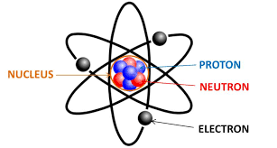

L'**electricitat** consisteix en aprofitar l'**energia** que genera aquest moviment d'**electrons** per tal de realitzar les activitats que ens interessin. Aquesta **energia** pot ser emmagatzemada a través de **piles** o **bateries** per ser utilitzada més endavant, pot ser generada a través de **generadors** com en les centrals elèctriques i pot ser utilitzada per moltíssims aparells com ara bombetes, estufes o electrodomèstics. 

<h3> El circuit elèctric i els seus components </h3>

Un **circuit elèctric** és un conjunt d'elements que connectats entre si formen un camí tancat on el **corrent elèctric** hi pot circular. Els **circuits elèctrics** tenen tres components clau sense els quals no pot funcionar: els **generadors**, els **conductors** i els **receptors**.
- Els **generadors** són els components que generen la circulació dels **electrons** i per tant de l'**electricitat**, podriem dir que "**empènyen**" els **electrons** per que avancin a través del circuit. Podem identificar diversos components com a generadors com ara: piles, bateries, alternadors o dinamos. A continuació hi ha imatges amb els seus símbols:
    - Pila 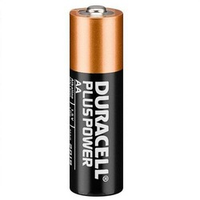
    - Bateria 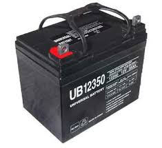
    - Dinamo 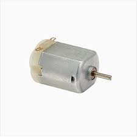
    - Alternador 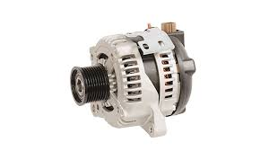
    - Símbol de generador 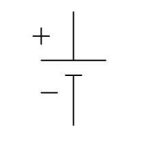
- Els **conductors** són els components que transporten l'**electricitat** pel **circuit** i tenen forma de cable. En podem trobar de molts elements diferents com ara:
  - Coure- El més típic per la seva **facilitat** per conduir l'**electricitat** i per ser bastant comú a la naturalesa.
  - Alumni- També molt utilitzat encara que sigui pitjor conductor que el coure ja que és molt **lleuger** i barat.
  - Or, níquel i crom- Utilitzats en components **electrònics** per evitar la oxidació i per seva **conducció** de l'electricitat excel·lent.
  - Estany, plom i plata- Utilitzats per **soldar** components per la facilitat amb la que es **fonen** i es manipulen en forma líquida. 
  
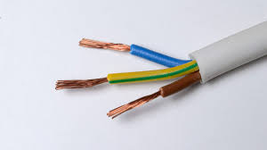

Els materials que no són **conductors** i que, per tant, no deixen passar l'electricitat de forma fàcil a través seu s'anomenen **aïllants** i alguns exemples són: l'aire, l'aigua pura, la fusta, el plàstic...

- Els **receptors** són els components que reben l'**electricitat** i l'utilitzen per alguna funció transformant l'**energia elèctrica** en alguna altra forma d'**energia**. Per exemple: les **bombetes** incandescents la transformen en **energia lumínica i calorífica**, els **motors** en **energia mecànica**, les **estufes** en **energia calorífica**, els **timbres** en **energia sonora**... Aquests **receptors** cal que rebin la quantitat d'**electricitat** adequada per tal de funcionar correctament i, per tant, a vegades cal regular la quantitat d'**electricitat** que reben. Això es fa a través de **resistències** que són components **receptors** que només serveixen per tal de regular la **quantitat d'electricitat** que flueix pel circuit. A contínuació hi ha els símbols o imatges dels receptors més rellevants:
  - Resistència 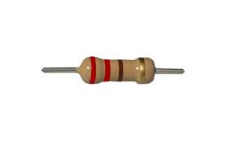

  - Bombeta 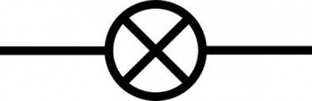
  - Motor 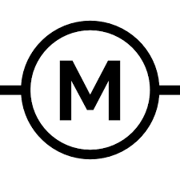
  
A part d'aquests tres tipus de components clau, n'hi ha dos altres que no són imprescindibles però si importants: els components de **control** i els components de **protecció**.
- Els components de **control** són els components que permeten **obrir o tancar** el circuit a voluntat. N'hi ha tres de més rellevants: l'interruptor, el commutador i el polsador. 
  - L'**interruptor** permet obrir i tancar el circuit a través d'una acció externa. Cada acció pasa el interruptor d'obert a tancat o de tancat a obert.  
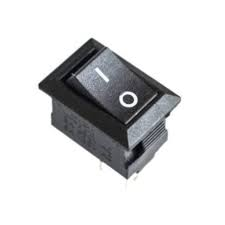
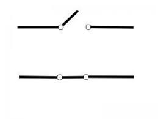
  - El **commutador** permet passar d'un circuit a un altre a través d'una acció externa. Cada acció pasa el circuit d'un a l'altre. És com un interruptor però canvia de circuit en comptes d'obrir o tancar.  
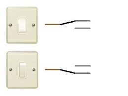
  - El **polsador** permet obrir o tancar el circuit a mentre es fa una acció externa. Cada acció canvia el interruptor d'obert a tancat o de tancat a obert mentre s'està realitzant. Un polsador pot ser "normalment tancat" que vol dir que sempre deixa passar l'electricitat i quan es polza no passa o pot ser "normalment obert" que vol dir que mai deixa passar l'electricitat i quan es polza la deixa passar.  
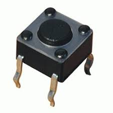
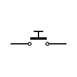 
- Els components de **protecció** són els components que protegeixen a l'**usuari** i al **circuit** d'errors i mals usos de l'electricitat. Podem identificar els **fusibles**, **interruptors automàtics** i **interruptors diferencials**.
  - Els **fusibles** són **resistències** que estan fetes d'un material que quan flueix massa electricitat a través seu, es **fon** i s'**obra** el circuit.  

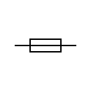
  - Els **interruptors automàtics** són interruptors que s'activen automàticament quan detecta que alguna magnitud supera algun límit.
  - Els **interruptors diferencials** són interruptors que s'activen automàticament abans que hi pugui haver una electrocució.
  
Unint tots aquests components i símbols es poden crear molts circuits diferents que tenen moltes funcions diferents. Tot i aixó, els components exposats fins ara són una simplificació i n'hi ha molts més i de més complexos.

**Recursos i exercicis**
- Web per fer simulacions de circuits elèctrics [1r-4t ESO] [Enllaç](https://www.tinkercad.com/circuits)
- Exercici d'identificació de components i interpretació de circuits [1r-2n ESO] [Enllaç](../assets/files/electricitatElectrònica/Components%20d'un%20circuit%20elèctric.pdf)  
- Exercici de simulació de circuits [1r-2n ESO] [Enllaç](../assets/files/electricitatElectrònica/Simulació%20de%20circuits.pdf)
- Solucionari de l'exercici de simulació de circuits [1r-2n ESO] [Enllaç](../assets/files/electricitatElectrònica/Simulació%20de%20circuits%20solucionari.pdf)

[Comentari: Posar solució a l'exercici, més exercicis i recursos com ara un simulador]: #
  
<h3> Magnituds elèctriques </h3>
Hi ha tres magnituds elèctriques clau: el **voltatge**, la **intensitat** i la **resistència**.
- El **voltatge** és la **força** amb la qual el generador **empeny** l'electricitat per tal que flueixi pel circuit. En un mateix circuit, com més força faci, més electricitat circularà. Des del punt de vista dels receptors podem dir que cada receptor **rep** una part de la **força** que fa el generador i que la suma dels voltatges dels receptors és igual a la suma dels voltatges dels generadors. El voltatge es representa amb la lletra **V**, es mesura amb **volts** i els volts es representen amb la lletra **V**.
- La **intensitat** és la **quantitat d'electricitat** que flueix per un circuit. És a dir, com més electricitat, més **electrons** flueixen i, per tant, més **energia** passa pel circuit. Per aquesta raó, la intensitat és la magnitud més important de controlar ja que és la que pot fer que una electrocució sigui perillosa o que un receptor o conductor s'escalfi massa. La intensitat és representa amb la lletra **I**, es mesura amb **ampers** i els ampers es representen amb la lletra **A**.
- La **resistència** és la **dificultat** que oposa un conductor o receptor a que l'electricitat passi per ell. Moltes vegades s'obvien els conductors per fer càlculs ja que tenen una resistència molt petita. Com més gran sigui la resistència, menys electricitat(intensitat) fluirà sempre i quan mantinguem la força amb la que l'empenyem(voltatge). La resistència es representa amb la lletra **R**, es mesura amb **ohms** i els ohms es representen amb el símbol **Ω**. 

| Nom de la magnitud | Símbol de la magnitud | Nom de la Unitat | Símbol de la unitat | Descripció |
| --- | --- | --- | --- | --- |
| Voltatge | V | Volts | V | Força que fa el generador per empènyer l'electricitat |
| Intensitat | I | Ampers | A | Quantitat d'electricitat que flueix per un circuit | 
| Resistència | R | Ohms | Ω | Dificultat que posa un component per què l'electricitat flueixi a través seu | 

<h3> La llei d'Ohm </h3>
La **llei d'Ohm** relaciona les tres magnituds clau de l'electricitat entre si de la següent forma. $$ V = R*I $$. Però, fent servir àlgebra també ho podem expressar com a $$ I = V/R $$ o $$ R = V*I $$. Per tal de memoritzar la llei d'Ohm més fàcilment podem fer servir la següent tècnica memotècnica:  
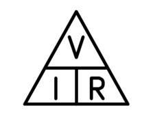  

Quan tapem cadascuna de les magnituds es pot veure la fòrmula per aconseguir-la. Per exemple, si tapem la resistència es pot veure el voltatge sobre de la intensitat. 

Per tant, podem concloure que el **voltatge** i la **resistència** i el **voltatge** amb l'**intensitat** són **directament proporcionals**. És a dir, quan un es duplica, l'altre també ho fa i quan un es fa la meitat, l'altre també ho fa. En canvi, la **resistència** i la **intensitat** són **inversament proporcionals**. És a dir, quan un es duplica, l'altre es fa la meitat i quan un es fa la meitat, l'altre es duplica. 

[Comentari: Posar una imatge de la proporcionalitat directa i inversa]: #

<h3> Circuits série i paral·lel </h3>

Fins ara hem fet circuits simples on només hi ha un generador i un receptor. 
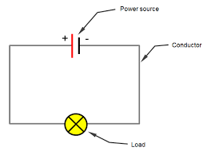

Però, aquests circuits no sempre són realistes ja que tenim components de diferents magnituds i a vegades cal combinar-los. Primer de tot tenim els **circuits série** on els components estan un seguit dels altres en el **mateix cable**.  
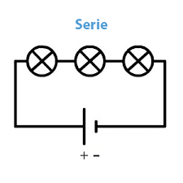  

En aquests circuits el corrent va pasant d'un component a un altre de forma **seqüencial**. Per tant, si algun dels components tingués una averia i tallés el circuit, tot el circuit quedaria obert i no funcionaria. 

Si tenim diferents generadors en série el seu voltatge es suma ja que la seva força es reforça entre si. Per tant, podem suposar que $$V_t=V_1+V_2+...+V_i$$ on $$V_t$$ és el voltatge resultant i la resta són tots els voltatges de tots els generadors en série, que poden ser dos, tres o qualsevol nombre. El mateix passa amb els receptors, el voltatge que consumeixen els receptors en série també es la suma del voltatge que consumeixen els receptors individualment. Per tant, podem dir que el voltatge disponible pels receptors en série es reparteix entre tots els receptors.

El mateix passa amb la resistència, podem suposar que $$R_t=R_1+R_2+...+R_i$$ on $$R_t$$ és la resistència resultant, i la resta són totes les resistències de tots els receptors en série, que poden ser dos, tres o qualsevol nombre.

La intensitat en canvi podem dir que es manté ja que com que en els circuits en série tots els components estan en el mateix cable, la intensitat no pot ser diferent. Per tant, podem suposar que $$I_t=I_1=I_2=...=I_i$$ on $$I_t$$ és la intensitat resultat i la resta són les intensitats de tots els receptors en série, que poden ser dos, tres o qualsevol nombre. 

I els altres tipus de circuits són els circuits **paral·lels** que són aquells on des d'un punt surten **diferents cables** que passen per algun component i tornen al mateix punt. 

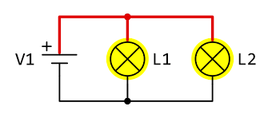

En aquests circuits el corrent es **divideix** en diferents cables, també anomenats **branques**, i passa en tots els components alhora. Per tant, si algun dels components tingués una averia i tallés el circuit, només aquella branca quedaria oberta i la resta del circuit seguiria funcionant.

Si tenim diferents generadors en paral·lel el seu voltatge es manté ja que no pot afegir la seva força, aixó si, si estem parlant de piles o bateries, si que augmenta la seva durada abans que es gastessin. Per tant, podem suposar que $$V_t=V_1=V_2=...=V_i$$ on $$V_t$$ és el voltatge resultat i la resta són els voltatges de tots els generadors en paral·lel, que poden ser dos, tres o qualsevol nombre. El mateix passa amb els receptors, el voltatge que consumeixen els receptors en paral·lel també es manté en totes les branques. Per tant, podem dir que el voltatge disponible pels receptors en paral·lel es manté entre tots els receptors.

Amb la resistència, per tal de calcular l'inversa de la resistència equivalent es fa la suma de les inverses de les resistències de cada branca. Per tant, podem suposar que $$1/R_t=1/R_1+1/R_2+...+1/R_i$$ on $$R_t$$ és la resistència resultant i la resta són totes les resistències de tots els receptors en paral·lel, que poden ser dos, tres o qualsevol nombre. Aquesta fórmula pot ser una mica complicada i en els casos on només hi ha dues branques, hi ha una fòrmula simplificada. Per tant, en els casos on només hi ha dues branques podem suposar que $$R_{12}=\frac{R_1*R_2}{R_1+R_2}$$. 

La intensitat en canvi podem dir que es reparteix ja que com que els circuits en paral·lel es separen els diferents branques, la quantitat d'electricitat també es reparteix en les diferents branques. Per tant, podem suposar que $$I_t=I_1+I_2+...+I_i$$ on $$I_t$$ és la intensitat resultat i la resta són les intensitats de tots els receptors en paral·lel, que poden ser dos, tres o qualsevol nombre. 

Tots aquest conceptes poden ser molts alhora, a continuació hi ha una taula resum:

| | Voltatge | Resistència | Intensitat |
| --- | --- | --- | --- |
| Série | $$V_t=V_1+V_2+...+V_i$$ El voltatge es reparteix | $$R_t=R_1+R_2+...+R_i$$   La resistència es reparteix| $$I_t=I_1=I_2=...=I_i$$ La intensitat es manté|
| Paral·lel | $$V_t=V_1=V_2=...=V_i$$ El voltatge es manté| $$1/R_t=1/R_1+1/R_2+...+1/R_i$$ La resistència aplica aquesta fòrmula| $$I_t=I_1+I_2+...+I_i$$ La intensitat es reparteix| 

<h3> Resolució de circuits </h3>

<h3> Energia i potència elèctrica </h3>

<h3> Magnistisme i electromagnetisme </h3>

<h3> Motors elèctrics i generadors </h3>

<h3> Electricitat a casa </h3>