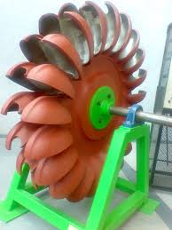
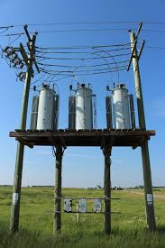
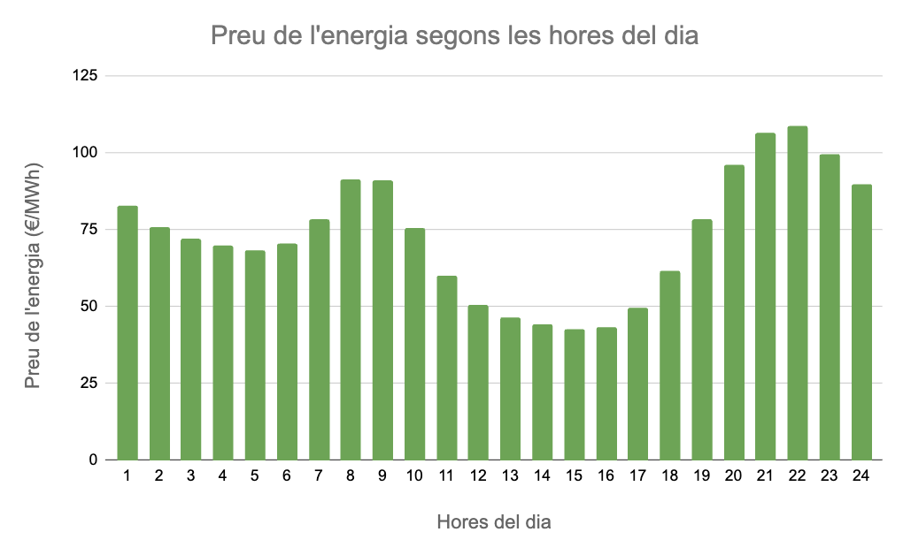
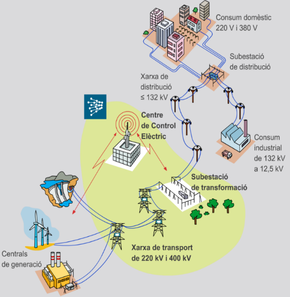

<h1> Generació i distribució d'energia </h1>

<h3> La energia i fonts d'energia </h3>
La energia és la capacitat dels cossos per fer un treball o per produïr un canvi en ells mateixos o en altres cossos. En resum, és la capacitat de fer alguna cosa. L'energia en mesura en Joules(J).

L'energia es pot manifestar de moltes formes diferents, entre elles:

- Energia mecànica- Energia que te un cos a causa del seu moviment(energia cinètica) o de la seva posició(energia potencial).
- Energia elèctrica- Energia dels electrons que es mouen per un conductor, molt versàtil i fàcil de convertir en altres tipus d'energia.
- Energia química- Energia que s'obté d'una reacció química com ara en una pila o bateria o en una combustió.
- Energia tèrmica- Energia que es transmet d'un cos a un altre en forma de calor.
- Energia radiant- Energia en forma d'ones electromagnètiques, principalment llum però també ones de ràdio, televisió, raig X o radiació.
- Energia sonora- Energia en forma de so que es propaga per l'espai.
- Energia nuclear- Energia que es desprén de les reacions als nuclis atòmics.

Una màquina és un cos que pot agafar un tipus d'energia i la transforma en una altra del mateix tipus o diferent. L'energia resultant pot ser d'un tipus o de molts diferents. L'energia que rep sempre és igual a l'energia que desprén però cal tenir en compte que part de l'energia que desprén serà energia no útil i que, per tant, sempre es perd part de l'energia que rep. Per posar alguns exemples de màquines:

- Energia elèctrica-> Motor elèctric -> Energia mecànica + Energia tèrmica + Energia sonora
- Energia mecànica-> Generador elèctric -> Energia elèctrica + Energia tèrmica + Energia sonora
- Energia química -> Motor de cotxe -> Energia mecànica + Energia tèrmica + Energia sonora
- Energia electrica -> Bombeta -> Energia radiant + Energia tèrmica

Podem veure que en molts casos hi ha una energia tèrmica i energia sonora a l'energia resultant. Aquesta energia és energia residual no útil que apareix dels fregaments o altres imperfeccions.

A part, podem classificar l'energia com a energia primària i energia final. L'energia primària és aquella que obtenim de la naturalesa sense cap transformacio com ara l'energia mecànica del vent o de l'aigua, l'energia química dels combustibles fòssils o l'energia radiant del sol. En canvi, l'energia final és l'energia que utilitza l'usuari final com ara l'energia tèrmica de les estufes, l'energia radiant de les bombetes o l'energia mecànica dels motors.

Finalment, les fonts d'energia són aquells recursos dels quals extraiem energia. Podem triar dos tipus de fonts d'energia:

- Fonts d'energia renovables- Es considera que són inesgotables i que mai s'acabaran. Per exemple: el sol, l'aigua, el vent...
- Fonts d'energia no renovables- Les reserves són limitades i disminueixen en el temps. Per exemple: el carbó, el petroli, el gas natural, l'urani...

<h3> Centrals elèctriques </h3>
Les centrals elèctriques són el cor del nostre sistema de generació i distribució d'energia i són una obra d'art de l'enginyeria que creix per moments. Hi ha molt tipus de centrals elèctriques amb molts tipus de fonts d'energia. Però, totes tenen una estructura semblant comuna que estudiarem a continuació. Hi ha una sola excepció a aquesta estructura comuna que són les centrals solars fotovoltaiques, però les estudiarem en profunditat més endavant.

Fent un resum de les centrals elèctiques podriem dir que primer de tot la font d'energia d'alguna forma fa girar una màquina anomenada turbina. Aquesta turbina està connectada a una generador o alternador que converteix l'energia mecànica de la turbina en energia elèctrica. I finalment aquesta energia elèctrica passa per un transformador per tal de preparar-la per transportar-se. Aquest és un resum molt esquemàtic i breu de com funcionen les centrals elèctriques, anem a veure més a profunditat cada part.

[Comentari: Posar un esquema de les centrals elèctriques]: #

Primer de tot tenim la turbina. La turbina rep una energia que pot provindre de moltes fons d'energia diferents: pot venir del vent en les centrals eòliques, de l'aigua en les centrals hidroelèctriques, del vapor d'aigua que ha escalfat una combustió de combustibles fòssil o una reacció nuclear... La qüestió és que aquesta font d'energia fa girar la turbina a través d'unes pales que té.  

Després hi ha el generador o alternador. Aquesta part quan està lligada a la turbina, les dues parts juntes es poden anomenar turbogenerador. El generador agafa l'energia mecànica de la turbina i la converteix en energia elèctrica, funciona com un motor elèctric però al revés. Per més informació es pot consultar la part de electromagnetisme de la part d'electricitat.

Finalment hi ha el transformador. El transformador agafa l'energia elèctrica del generador i la estabilitza per facilitar el seu transport. Els transformadors són dos bobines que a través de modificar el nombre d'espires(voltes de la bobina) poden modificar el voltatge i intensitat a costa de l'altre. Quan puja l'intensitat, baixa el voltatge i quan puja el voltatge, baixa l'intensitat. En el cas dels transformadors de les central elèctriques el que importa es fer que el voltatge sigui el màxim de gran possible per tal de facilitar el transport de l'electricitat, més endavant s'explica perquè és important que el voltatge sigui el més gran possible.  

A continuació comencem a parlar sobre els diferents tipus de centrals elèctriques que hi ha i les seves particularitats.

**Centrals tèrmiques convencionals**  
Les centrals tèrmiques convencionals són aquelles que utilitzen combustibles per tal de generar l'energia necessària. Aquests combustibles generalment són combustibles fòssils com ara carbó, gas natural o gasoil però també existeixen les centrals tèrmiques de RSU (Residus sòlids urbans) on el combustible són els residus que es generen en les ciutats.

Els passos que  segueix l'energia són els següents:

- Química → Tèrmica: El combustible es crema a la caldera, alliberant calor que s'utilitza per bullir aigua.
- Tèrmica → Cinètica: L'aigua es converteix en vapor a pressió que es canalitza cap a les turbines.
- Cinètica → Elèctrica: El vapor fa girar les pales de la turbina, que està connectada a un alternador.

Les centrals tèrmiques convencional es poden dividir en cinc zones clau:

- La caldera: És el forn on es produeix la combustió. Està envoltada de tubs per on circula aigua que es transforma en vapor a temperatures molt altes.
- La turbina: Un conjunt d'eixos amb pales que giren amb molta força quan el vapor hi passa.
- L'alternador: Està unit a l'eix de la turbina i generen el corrent elèctric a través del moviment de la turbina.
- El condensador: Un intercanviador de calor on el vapor, després de passar per la turbina, es torna a refredar per convertir-se en aigua líquida i tornar a començar el cicle.
- La xemeneia: Per on surten els fums resultants de la crema del combustible prèviament filtrats.

**Centrals nuclears**  
Les centrals nuclears són aquelles que utilitzen materials radioactius per tal de generar l'energia tèrmica necessària. Aquest combustible generalment és l'urani o el plutoni, els quals pateixen reaccions de fissió nuclear a l'interior d'un reactor per alliberar quantitats massives de calor, a diferència de la combustió tradicional.

Els passos que segueix l'energia són els següents:

- Nuclear → Tèrmica: El nucli de l'àtom de combustible es divideix (fissió) a l'interior del reactor, alliberant una gran quantitat de calor que s'utilitza per escalfar aigua.
- Tèrmica → Cinètica: L'escalfament de l'aigua genera vapor a alta pressió que es canalitza amb força cap a les turbines.
- Cinètica → Elèctrica: El vapor fa girar les pales de la turbina, que està connectada a un alternador.
  
Les centrals nuclears es poden dividir en cinc zones clau (molt similars a les tèrmiques, però amb algunes diferències fonamentals):

- El reactor nuclear (equivalent a la caldera): És el recinte fortament blindat on es produeix la fissió nuclear. Conté el combustible i està dissenyat per suportar altes pressions i temperatures, transferint la calor a l'aigua per generar vapor.
- La turbina: Un conjunt d'eixos amb pales que giren a gran velocitat quan el vapor a pressió hi passa.
- L'alternador: Està unit a l'eix de la turbina i genera el corrent elèctric aprofitant el moviment mecànic de la turbina.
- El condensador: Un intercanviador de calor on el vapor, després de fer la seva feina a la turbina, es torna a refredar per convertir-se en aigua líquida i retornar al cicle tancat cap al reactor o generador de vapor.
- La torre de refrigeració (en lloc de la xemeneia de fums): És la gran estructura característica d'aquestes centrals. Serveix per refredar l'aigua del circuit de refrigeració extern del condensador. El que surt per dalt no és fum ni contaminació, sinó exclusivament vapor d'aigua inofensiu.

**Centrals hidroelèctriques**  
Les centrals hidroelèctriques són aquelles que utilitzen la força i el moviment de l'aigua per tal de generar l'energia necessària. En aquest cas no s'utilitza cap "combustible" que es cremi, sinó que s'aprofita l'energia de l'aigua emmagatzemada a una certa altura (generalment en un embassament creat per una presa) o bé la força natural del cabal d'un riu.

Els passos que segueix l'energia són els següents:

- Potencial → Cinètica: L'aigua emmagatzemada a certa altura cau a través d'unes canonades, perdent altura però guanyant molta velocitat i pressió.
- Cinètica → Mecànica: L'aigua a pressió impacta contra les pales de la turbina i la fa girar amb força.
- Mecànica → Elèctrica: El gir de la turbina es transmet a un alternador al qual està connectada, generant el corrent elèctric.

Les centrals hidroelèctriques es poden dividir en cinc zones clau:

- L'embassament i la presa (l'equivalent a l'emmagatzematge de combustible): És la gran infraestructura que reté l'aigua del riu i crea el desnivell necessari per acumular energia potencial.
- Les canonades: Són els conductes per on baixa l'aigua a gran pressió i velocitat des de l'embassament fins a la sala de màquines on hi ha les turbines.
- La turbina: Una gran roda hidràulica amb pales que gira quan rep l'impacte de l'aigua.
- L'alternador: Està unit a l'eix de la turbina i genera el corrent elèctric aprofitant el moviment rotatori que li transmet la turbina.
- El canal de desguàs : És el canal per on l'aigua, un cop ha cedit la seva energia a la turbina, es retorna de manera tranquil·la i totalment neta a la llera del riu per seguir el seu curs natural.

**Centrals eòliques**
Les centrals eòliques són aquelles que utilitzen la força del vent per tal de generar l'energia necessària. En aquest cas no s'utilitza cap combustible ni s'escalfa aigua, sinó que s'aprofita directament l'energia de les masses d'aire en moviment a través d'unes màquines anomenades aerogeneradors.

A diferència de les centrals tèrmiques o nuclears, el procés és més directe i els passos que segueix l'energia es resumeixen principalment en dos:

- Cinètica → Mecànica: L'energia cinètica del vent impacta contra les pales de l'aerogenerador, empenyent-les i fent-les girar, transformant així l'energia del vent en energia mecànica de rotació.
- Mecànica → Elèctrica: El moviment giratori es transmet a través d'un eix fins a un generador (alternador), que s'encarrega de transformar aquesta energia mecànica en corrent elèctric.

Si ens fixem en un sol aerogenerador (que seria l'equivalent a la "central" individual dins d'un parc eòlic), podem dividir-lo en cinc zones clau:

- El rotor (juntament amb les pales): És la part exterior dissenyada aerodinàmicament per captar la força del vent. Vindria a fer la funció de la turbina, ja que és l'element que gira en rebre l'impacte de l'aire.
- La multiplicadora (o caixa de canvis): És un sistema d'engranatges connectat a l'eix del rotor. Com que les pales giren relativament a poc a poc (unes 15-20 revolucions per minut), la multiplicadora augmenta aquesta velocitat fins a les gairebé 1.500 rpm que necessita el generador per funcionar correctament.
- El generador (l'alternador): Està acoblat a la multiplicadora i és l'element que finalment genera el corrent elèctric a través del ràpid moviment mecànic que rep.
- La góndola: És l'habitacle o carcassa situada a la part superior de la torre. A l'interior hi ha tots els elements clau protegits (multiplicadora, generador i sistemes de control orientatius perquè el rotor sempre miri de cara al vent).
- La torre: És l'estructura que suporta tot el pes de la góndola i el rotor. La seva funció és elevar les pales a una gran altura, on el vent bufa amb més força, de manera més constant i sense les turbulències del nivell del terra.  

**Centrals solars fotovoltaiques**  
Les centrals solars fotovoltaiques són aquelles que utilitzen la radiació del sol per tal de generar l'energia necessària. En aquest cas no s'utilitza cap combustible, ni s'escalfa aigua, ni s'aprofita la força del vent o l'aigua. S'aprofita l'energia de les partícules de llum (fotons) que impacten sobre uns materials semiconductors, generant electricitat a través del que coneixem com a efecte fotoelèctric.

A diferència de les centrals tèrmiques, nuclears o hidroelèctriques, aquí ens saltem l'energia cinètica i mecànica. Els passos que segueix l'energia són més directes:

- Radiant (Llum) → Elèctrica (Corrent Continu): La llum del sol impacta sobre les cèl·lules fotovoltaiques dels panells, excitant els electrons del material i generant un corrent elèctric continu.
- Elèctrica (Corrent Continu) → Elèctrica (Corrent Altern): Aquest corrent continu passa per un aparell que el transforma en corrent altern, que és el tipus d'electricitat que utilitzem a les nostres llars i a la xarxa elèctrica.

Si dividim una central solar fotovoltaica en les seves zones clau, en destaquem tres:

- Els panells solars: Són l'element principal (farien la feina conjunta de la caldera i la turbina). Estan formats per milers de cèl·lules que capten la llum solar i la converteixen directament en electricitat.
- L'inversor: És un equip electrònic fonamental. Fa l'equivalent a la feina final de l'alternador, ja que s'encarrega de transformar el corrent continu que surt dels panells en el corrent altern que necessita la xarxa.
- Les estructures de suport (i seguidors solars): Són les estructures metàl·liques que aguanten els panells. En moltes centrals modernes no són fixes, sinó que són "seguidors" motoritzats que van girant a poc a poc per perseguir el sol durant el dia, com els gira-sols, per maximitzar-ne la captació.

<h3> Transport i distribució de l'energia </h3>
Hem treballat fins ara com es genera l'energia a les centrals elèctriques però on es necessita l'electricitat és a les cases, fàbriques i ciutats. En un primer moment es pot pensar que la millor manera és emmagatzemar aquesta electricitat i després utilitzar-la on i quan interessi. Però, tot i que si que existeixen les bateries elèctriques, les bateries disponibles no són prou grans ni duren prou com per fer que aquesta idea sigui possible. Per tant, necessitem utilitzar l'electricitat al mateix moment que es genera i ha de ser la mateixa quantitat. Aixó genera molts problemes on durant el dia es necessiten diferents quantitats d'electricitat a diferents hores. Aquí es especialment evident un dels punts febles de l'energia solar i eòlica que és la seva disponibilitat variable. Aquestes fonts d'energia no poden ser la base de la generació d'energia quan no sabem si estaràn disponibles aquell dia o en aquell moment. Per tant, l'energia solar i eòlica estan destinades a tenir un paper secundàri fins que es pugui solucionar aquest inconvenient.

A continuació podem veure una gràfica per hores del preu de l'electricitat, no és exactament el consum però està lligat amb ell i ens permet veure que hi ha hores vall i hores pic on cal menys o més electricitat.

Generalment, durant totes les hores hi ha en funcionament les centrals nuclears i tèrmiques ja que costen molt de posar en funcionament i no val la pena parar-les. Les centrals eòliques i solars s'intenta que funcionin el màxim de temps possible. I les centrals hidroelèctriques funcionen com a regulador ja que són molt fàcils i ràpides de posar en funcionament. També són important les centrals hidroelèctriques reversibles que permeten tindre un consum extra en les hores vall sense haver de parar cap altra central.

Per tal de moure tota aquesta electricitat des de les centrals fins als punts de consum hi ha una xarxa de consum enorme. El principal problema d'aquesta xarxa és la pèrdua d'energia per calor durant el transport per la llei de Joule. Per tal de mitigar aquest problema es fan servir els transformadors per tal d'augmentar el voltatge a un valor molt elevat i per tant fer baixar la intensitat a un valor molt baix. Aquesta baixa intensitat permet reduïr les pèrdues per la llei de Joule al mínim. Al sortir de la central elèctrica s'augmenta el voltatge fins a valors considerats d'alta tensió(al voltant de 220kV als 400kV). Aquesta alta tensió permet transportar l'electricitat llargues distàncies sense gaires pèrdues d'energia però requereix d'una gran infrastructura per garantir la seguretat de l'entorn per on passa l'electricitat. Un cop d'acosta als centres de consum, l'electricitat passa per substacions de transformació que baixa el voltatge a mitja tensió(menys de 132kV) que augmenten les pèrdues però faciliten molt el seu transport a prop dels centres de transformació. Finalment, quan arriba als centres de consum passa per una subestació de distribució que baixa el voltatge a baixa tensió que pot ser per consum industrial(de 12,5kV a 132kV) o per consum domèstic(de 220V a 380V). Aquesta tensió és la que ens trobem en els endolls a casa o a l'institut. A continuació hi ha un esquema que representa aquest procés.

<h3> Impacte mediambiental </h3>
Totes les centrals que hem presentat anteriorment tenen un impacte mediambiental més o menys gran. Anem a analitzar-lo central per central:  

**Centrals Tèrmiques Convencionals (Carbó, Gas, Gasoil, RSU)**

Aquestes centrals tenen un dels impactes més directes i evidents sobre el canvi climàtic a causa de la crema de combustibles.

- Residus i contaminació: Generen grans quantitats de gasos d'efecte hivernacle (principalment CO₂), responsables de l'escalfament global. També emeten gasos tòxics (òxids de sofre i nitrogen) que causen la pluja àcida, a més de partícules fines i cendres sòlides. En el cas de les de RSU, els fums poden contenir toxines severes (com dioxines) si els filtres no són extremadament rigorosos, i deixen unes cendres altament tòxiques que s'han d'enterrar en abocadors especials.
- Impacte en la construcció: Requereixen molt d'espai i infraestructures complexes. A més, cal sumar-hi el greu impacte previ de la mineria (extracció de carbó, urani) o de les plataformes d'extracció (gas, petroli) i el seu transport.
- Impacte en el funcionament: A banda de l'emissió constant de fum, utilitzen grans quantitats d'aigua d'entorns naturals (rius o mars) per refrigerar el sistema. Quan retornen aquesta aigua, sol estar molt més calenta (contaminació tèrmica), la qual cosa altera greument l'ecosistema aquàtic local.

**Centrals Nuclears**  
L'impacte climàtic és molt baix, però presenten riscos de contaminació molt duradors i complexos de gestionar.

- Residus i contaminació: No emeten CO₂ ni gasos contaminants a l'atmosfera durant el seu procés de generació. No obstant això, generen residus radioactius (d'alta, mitjana i baixa activitat). Els d'alta activitat (el combustible gastat) continuen sent perillosos durant milers d'anys i requereixen un emmagatzematge geològic profund molt estricte. També hi ha el risc, tot i que estadísticament baix, d'un accident nuclear que alliberi radioactivitat a l'entorn.
- Impacte en la construcció: Necessiten una inversió brutal de materials (milions de tones de formigó armat i acer) per garantir-ne l'estanquitat i la seguretat. També cal tenir en compte l'impacte ambiental de la mineria i l'enriquiment de l'urani.
- Impacte en el funcionament: L'impacte diari més notable (a banda de la generació de residus interns) és la contaminació tèrmica de l'aigua, ja que necessiten refrigerar constantment el nucli. Alliberen grans quantitats de vapor d'aigua (innocu) i, sovint, aigua calenta als rius o mars propers.

**Centrals Hidroelèctriques**  
Són una font d'energia renovable, però la seva infraestructura altera dràsticament la geografia natural.

- Residus i contaminació: No generen residus químics ni emissions directes durant l'operació.
- Impacte en la construcció: És l'impacte visual i territorial més agressiu de totes. Requereix inundar valls senceres, cosa que destrueix boscos, hàbitats terrestres i, sovint, obliga a desplaçar poblacions humanes senceres.
- Impacte en el funcionament: Altera completament la vida del riu. Suposa una barrera infranquejable per a peixos migratoris (com el salmó, si no hi ha escales adequades), canvia la temperatura de l'aigua i reté els sediments que haurien de nodrir naturalment els deltes i les costes riu avall.

**Centrals Eòliques**  
És una de les energies més netes, però genera debats importants pel seu encaix en el paisatge i el territori.

- Residus i contaminació: No emeten cap gas ni contaminen l'aigua o el sòl. El gran repte actual a nivell de residus és què fer amb les pales dels aerogeneradors un cop acaben la seva vida útil (uns 20-25 anys), ja que estan fetes de materials compostos (fibra de vidre o carboni i resines) molt difícils de reciclar actualment.
- Impacte en la construcció: Requereixen obrir pistes forestals i moure molta terra per transportar i ancorar peces gegantines. A més, s'utilitza molt d'acer, formigó (per a les bases) i materials poc comuns per als generadors (terres rares).
- Impacte en el funcionament: Generen un impacte visual fort (alteren la línia del paisatge) i un impacte acústic local pel tall del vent. A nivell de fauna, poden suposar un risc de col·lisió important per a aus rapinyaires i ratpenats, depenent de si s'han ubicat en rutes migratòries.

**Centrals Solars Fotovoltaiques**  
Tot i ser molt netes i silencioses operativament, requereixen una gran quantitat de territori per igualar la potència d'altres centrals.

- Residus i contaminació: Generació elèctrica lliure d'emissions. Ara bé, la fabricació dels panells implica productes químics tòxics i extracció de minerals (silici, plata, coure, alumini). Quan els panells es fan vells, esdevenen un residu electrònic que requereix processos de reciclatge específics per recuperar-ne els components útils i no contaminar.
- Impacte en la construcció: El principal conflicte és l'ocupació del sòl. Per generar molta energia calen milers de panells, fet que pot competir directament amb camps de cultiu agrícoles o modificar dràsticament hàbitats d'espècies d'aus i flora.
- Impacte en el funcionament: Pràcticament nul. Són silencioses i no molesten la fauna un cop instal·lades.

<h3>Presentacions d'exemple</h3>
A continuació hi ha unes presentacions realitzades a classe sobre centrals elèctriques:

- Central tèrmica. [Presentació 1](/assets/files/energia/Presentació%20tèrmiques%201.pdf) [Presentació 2](/assets/files/energia/Presentació%20tèrmiques%202.pdf)
- Central nuclear. [Presentació 1](/assets/files/energia/Presentació%20nuclears%201.pdf) [Presentació 2](/assets/files/energia/Presentació%20nuclears%202.pdf)
- Central hidroelèctrica. [Presentació 1](/assets/files/energia/Presentació%20hidroelèctrica%201.pdf) [Presentació 2](/assets/files/energia/Presentació%20hidroelèctriques%202.pdf)
- Central eòlica. [Presentació 1](/assets/files/energia/Presentació%20eòlica%201.pdf) [Presentació 2](/assets/files/energia/Presentacio%20eòlica%202.pdf)
- Central solar fotovoltaica. [Presentació 1](/assets/files/energia/Presentació%20solars%201.pdf) [Presentació 2](/assets/files/energia/Presentació%20solars%202.pdf)

<h3> Exemples i exercicis </h3>
Prova centrals elèctriques. [2n ESO] [Enllaç](../assets/files/energia/Prova%20centrals%20elèctriques.pdf)  
