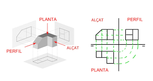
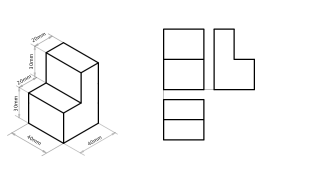
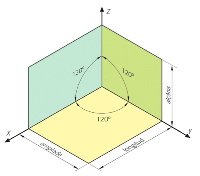
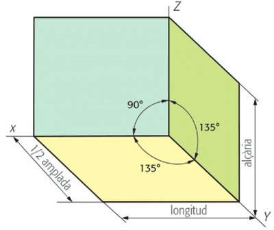

<h1> Expressió gràfica </h1>

<h3> Definicions i teoria </h3>
La **expressió gràfica** és el sistema de comunicació visual que utilitza dibuixos i plànols per mostrar idees, objectes i espais. Abans de seguir cal diferenciar entre **dibuix tècnic** i **dibuix artístic**. El **dibuix tècnic** és un dibuix precís i normalitzat que serveix per representar objectes i construccions de manera exacta. En canvi el **dibuix artístic** és un dibuix que expressa objectes, però també idees o emocions, tal com les percep l'artista.

En el dibuix tècnic podem trobar dos tipus de dibuixos: el **croquis** i el **plànol**. El **croquis** és un dibuix ràpid i a mà alçada que mostra una idea sense massa detalls. El **plànol** és la representació gràfica detallada i a escala d’un objecte, un edifici o un espai. Generalment, els plànols han de portar **acotacions** que són anotacions de mesures per indicar les dimensions reals.

En els **plànols** es representa un objecte de forma **proporcional**, aixó vol dir que hi ha una relació equilibrada entre les mides d’un dibuix i les de la realitat. Aquesta relació entre la mida del dibuix i la mida real de l’objecte s'anomena **escala** i s'expressa com dos nombres separats per dos punt (X:X). Indica doncs quantes vegades més gran o més petit és el dibuix respecte la realitat.

Els plànols representen un objecte vist de dalt o altrement dit, la seva **planta**. Aixó s'anomena una **vista** però n'hi ha altres com ara l'**alçat**, que és vist des de davant, el **perfil**, que és vist des del costat. 

<h3> Sistema dièdric </h3>
Quan volem representar un objecte en un paper, tenim un problema: el món és en 3 **dimensions** (amplada, alçada i profunditat), però el paper només en té 2 (amplada i alçada). Com podem ensenyar totes les cares d’un objecte de manera clara i precisa? La solució és el **sistema dièdric**.

El **sistema dièdric** pot mostrar un objecte des de sis punts de vista diferents; tot i que amb tres ja en tenim prou per fer-nos una idea exacta de l'objecte: són la *planta*, el *perfil* i l'*alçat*. La planta és l'objecte vist des de **dalt**, l'alçat des de **davant** i el perfil vist del **costat**. 

Si en aquestes representacions, alguna línia queda tapada per unes altres, s'ha de representar en línia discontínua.

  

[Comentari: Posar més imatges sobre sistema dièdric]: #

**Exercicis i recursos**  
- Web amb exercicis online interactius per dibuixar el sistema dièdric a partir d'una figura. [1r-2n ESO] [Enllaç](https://www.educacionplastica.net/3dcube_model/vistas_3d_2x2.html)
- La mateixa web però construïnt la figura a partir del sistema dièdric. [1r-2n ESO] [Enllaç](https://www.educacionplastica.net/3dcube_model/3dvoxels_0.htm?no=00)
- Fitxa amb exercicis senzills de Picuino [2n ESO] [Fitxer](../assets/files/expressioGrafica/sistemaDiedricFitxaSenzill.pdf)
- Fitxa amb exercicis amb rampes de Picuino [2n ESO] [Fitxer](../assets/files/expressioGrafica/sistemaDiedricFitxaRampes.pdf)

[Comentari: Penjar les solucions a aquestes fitxes]: #

<h3> Escales </h3>
Les **escales** són una manera de **reduir** o **ampliar** un dibuix, mantenint les **proporcions**. Però què vol dir mantenint les proporcions? Vol dir que si augmentem o reduïm una part de l'objecte, totes les altres parts augmenten o redueixen en la mateixa mesura. 

Una escala és la **relació** entre la mida del dibuix i la mida real de l’objecte. Sempre s’expressa amb una fracció:
- 1:1 → Escala **natural** (el dibuix té la mateixa mida que la realitat).
- 1:n → Escala de **reducció** (el dibuix és més petit que la realitat).  Per exemple: 1:2 vol dir que el dibuix és la meitat que la realitat.
- n:1 → Escala **d’ampliació** (el dibuix és més gran que la realitat). Per exemple: 5:1 vol dir que el dibuix és cinc vegades més gran que la realitat.

**Exercicis i recursos**
- Fitxa amb exercicis de totes les dificultats d'escales.[1r-2n ESO] [Fitxer](../assets/files/expressioGrafica/escalesFitxa.pdf)
- Fitxa amb exercicis de totes les dificultats d'escales. Solucionari.[1r-2n ESO] [Fitxer](../assets/files/expressioGrafica/escalesFitxaSolucionari.pdf)

<h3> Perspectives </h3>

Però el sistema dièdric no és l'única forma de representar objectes de tres dimensions en dues. També es poden fer servir les perspectives. Nosaltres veurem la perspectiva isomètrica i la caballera.

- La perspectiva isomètrica representa els objectes en tres eixos que formen angles de 120º entre ells. 

- La perspectiva cavallera representa els objectes en tres eixos on dos eixos formen un angle recte(90º) i els altres dos formes angles de 135º. Generalment, l'eix que representa l'amplada se li aplica una escala 1:2 per fer que el dibuix sembli més real.

Crear els eixos pot ser una mica complicat i cal fer servir eines de dibuix tècnic per tal de que quedin bé les representacions. Per tant, per tal de començar es fan servir unes plantilles.

- Plantilla de perspectiva isomètrica individual. [Enllaç](../assets/files/expressioGrafica/plantilla%20isometrica.png)
- Plantilla de perspectiva cavallera individual. [Enllaç](../assets/files/expressioGrafica/plantilla%20caballera.png)
- Plantilla de perspectiva isomètrica i cavallera de pàgina sencera. [Enllaç](../assets/files/expressioGrafica/Plantilla%20perspectives%20caballera%20i%20isomètrica.pdf)

**Exercicis i recursos**
- Web amb exercicis online interactius per practicar la perspectiva isomètrica a partir de pintar. [2n ESO] [Enllaç](https://www.educacionplastica.net/zirkel/pieza_iso3_00.html)
- Web amb exercicis online interactius per practicar la perspectiva isomètrica a partir de dibuixar. [2n ESO] [Enllaç](https://www.educacionplastica.net/zirkel/pieza_iso_00.html)
- Web amb exercicis online interactius per practicar la perspectiva cavallera a partir de dibuixar. [2n ESO] [Enllaç](https://www.educacionplastica.net/zirkel/pieza_cab_00.html)
- Exercicis perspectiva isomètrica. [2n ESO] [Enllaç](../assets/files/expressioGrafica/Exercicis%20perspectiva%20isomètrica.pdf)
- Exercicis perspectiva isomètrica i cavallera. [2n ESO] [Enllaç](../assets/files/expressioGrafica/Exercicis%20isomètrica%20i%20cavallera.pdf)
- Exercicis perspectiva isomètrica i cavallera resolts. [2n ESO] [Enllaç](../assets/files/expressioGrafica/Exercicis%20isomètrica%20i%20cavallera%20resolts.pdf)

[Comentari: Treure els exercicis externs i posar-ne de meus]: #
[Comentari: Posar anàlisi de mapes]: #

<h3> Exercicis i proves </h3>
Prova expressió gràfica. [1r ESO] [Enllaç](../assets/files/expressioGrafica/Prova%20representació%20gràfica.docx.pdf)  
Prova expressió gràfica adaptat. [1r ESO] [Enllaç](../assets/files/expressioGrafica/Prova%20representació%20gràfica%20adaptada.docx.pdf)  
Prova escales i sistema dièdric. [2n ESO] [Enllaç](../assets/files/expressioGrafica/Prova%20dièdric%20i%20escales.pdf)  
Prova escales i sistema dièdric adaptat. [2n ESO] [Enllaç](../assets/files/expressioGrafica/Prova%20dièdric%20i%20escales%20adaptat.pdf)  
Prova expressió gràfica. [2n ESO] [Enllaç](../assets/files/expressioGrafica/Prova%20perspectives.pdf)  
Prova expressió gràfica adaptat. [2n ESO] [Enllaç](../assets/files/expressioGrafica/Prova%20perspectives%20adaptat.pdf)  

