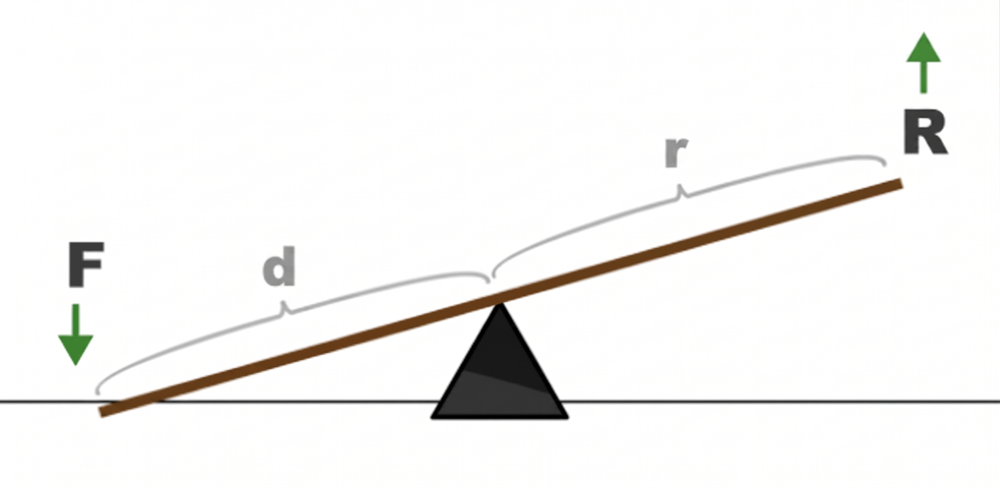
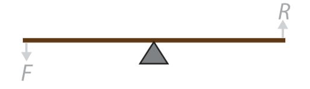
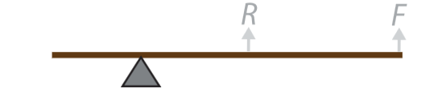
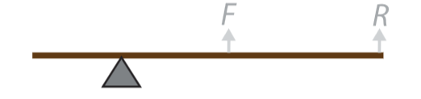
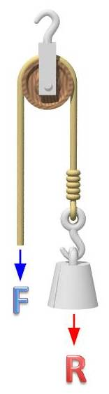
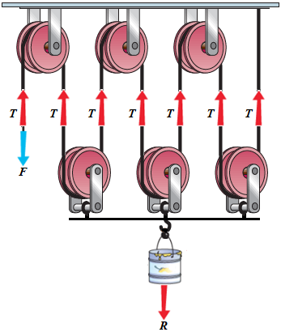
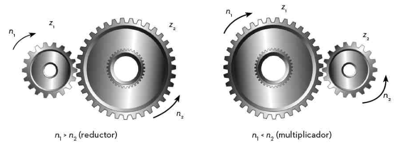

<h1> Màquines simples </h1>

Una màquina és un conjunt de mecanismes amb moviments coordinats, capaç de transformar energia en treball útil. Les màquines simples consten només d’un senzill mecanisme per transformar l’energia, tot utilitzant-la per produir treball.

Aquestes màquines involucren dues forces:

- Força motriu: És la força aplicada sobre la màquina, indicada amb una F.
- Força resistent:És la força que realitza la feina que volem obtenir, i es representa amb una R.

Les màquines simples transformen sempre la força motriu (F) en força resistent (R). Anem a veure els tipus de màquines simples:

<h3> Palanques </h3>
Una palanca és una barra rígida que pot girar lliurement al voltant d'un punt de suport, anomenat fulcre. Ens permet multiplicar la força que apliquem. Per definir una palanca necessitem els següents conceptes:
- Força o Potència (F): L'esforç que nosaltres fem.
- Resistència (R): El pes o la càrrega que volem moure.
- Braç de la força (d): La distància des del punt on apliquem la força fins al punt de suport.
- Braç de la resistència (r): La distància des del pes fins al punt de suport.

La llei de la palanca relaciona aquests conceptes mitjançant la següent equació:
$$F · d = R · r$$

A part podem identificar tres tipus de palanques:

- Palanca de primer grau: El fulcre sempre el trobem al mig, amb els punts d’aplicació de la F i de la R a extrem i extrem. Les tenalles i tisores són palanques de primer gènere.

- Palanca de segon grau: El fulcre està situat a un extrem i el punt d’aplicació de la resistència(R) queda entre el fulcre i el punt d’aplicació de la força(F). Multipliquen molt la força. L’exemple clàssic és el carretó, en què el fulcre és la roda.

- Palanca de tercer grau: El fulcre està en un extrem, però ara és el punt de l’aplicació de la força (F) el que es troba enmig del fulcre i el punt d’aplicació de la resistència(R). Redueixen la força, però donen precisió i abast. S’usen per a treballs que requereixen forces petites, però en els quals cal una bona precisió i control, com és el cas de les pinces, o per allargar el punt d’aplicació d’una força, com és el cas d’una escombra.

<h3> Politges </h3>
Una politja és una roda amb un canal a la vora per on es fa passar una corda, un cable o una cadena. Gira sobre un eix central i s'utilitza principalment per elevar càrregues amb comoditat. Podem trobar dos tipus de politges:
- Politja fixa o simple: Està penjada d'un punt fix. No estalvia esforç, però canvia la direcció de la força, permetent estirar cap avall (aprofitant el pes), la qual cosa és molt més còmoda. La seva formula és $$F = R$$ on l'esforç a fer és igual al pes a aixecar.

- Politja mòbil o polipast: Quan a una politja fixa se li afegeix una politja mòbil, hem creat un polispast. Aquí si que podem multiplicar la força que fem, es calcula fent servir la fòrmula $$F=R/2n$$ on $$n$$ és el nombre de politges mòvil, és a dir, aquelles que es mouen amb la càrrega. L'inconvenient de les politges mòbils és que per cada politja mòbil augmenta la quantitat de corda que s'ha d'estirar per fer pujar la resistència. 

<h1> Transmissió de moviment </h1>
Són mecanismes que poden incloure màquines simples que no només modifiquen la força que fan sinó que també modifiquen la velocitat de gir quan mouen el moviment d'un punt a un altre.

<h3> Engranatges </h3>
Els engranatges són mecanismes de transmissió formats per rodes amb dents que encaixen perfectament les unes amb les altres. Serveixen per transmetre el moviment circular d'un eix a un altre.

Quan dues rodes dentades estan en contacte, la que inicia el moviment s'anomena roda motriu (o conductora) i la que el rep s'anomena roda conduïda. És important saber que sempre giren en sentits oposats.

Cal tenir en compte dos conceptes en els engranatges:

- Velocitat de rotació (N): Es mesura en revolucions per minut (rpm).
- Nombre de dents (Z): Indica la mida de l'engranatge.

La fòrmula que relaciona aquests dos conceptes quan hi ha dos engranatges és $$N_m*Z_m=N_c*Z_c$$ on la $$m$$ es refereix a la roda motriu i $$c$$ a la roda conduida.

Un altre concepte a tenir en compte és la relació de transmissió (i) es defineix com $$i=N_c/N_m$$ si tenim en compte la velocitat i $$i=Z_m/Z_c$$. Segons el valor de la relació de transmissió, podem classificar l'engranatge com a reductor, multiplicador o directe.

- Si i=1: la part conduïda es mou a la mateixa freqüència que la motriu. Es parla d'engranatge directe.
- Si i>1: la part conduïda es mou a una freqüència més alta que la motriu. Parlem aleshores d’un engranatge multiplicador.
- Si i<1: la part conduïda es mou a una freqüència més baixa que la motriu. Ens trobem davant d’un engranatge reductor.

