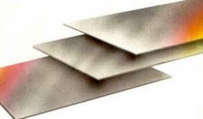
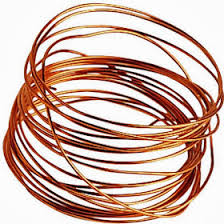
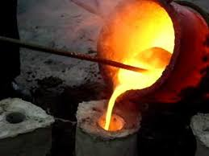
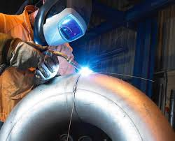

<h1> Materials </h1>

<h3> Definicions i teoria</h3>
Els materials són els diferents tipus de matèria amb què són fabricats els objectes i les construccions i els podem classificar entre:
- Materials naturals- Són aquells que s'extreuen directament de la natura.
- Materials transformats- Són aquells que són materials naturals i que s'han modificat d'alguna manera abans d'utilitzar-se.

Generalment, es podem dividir en 5 grans grups que són:
- Fusta- Material que prové dels arbres, com ara els llistons de pi o el paper.
- Metall- Materials extret de les mines com ara l'or o el ferro.
-  Plàstic- Materials transformats provinents principalment del petroli i carbó, com ara el poliestirè o el tefló.
- Petris o ceràmica- Fets principalment de pedra, sorra o argila com ara el marbre o el fang.
- Teixit- Material transformat de molts orígens diferents com ara animal, vegetal o mineral, com ara la seda o el lli.

Per diferenciar un material d'uns altres, es fan servir les seves propietats que s'estudiaràn en més profunditat més endavant. Hi ha cinc tipus de propietats: 
- Les físico-químiques- Mostren el comportament dels materials quan són exposats a accions externes com ara calor, corrent elèctric o humitat.
- Les tecnològiques- Són les propietats que defineixen el material quan se li intenta donar forma.
- Les mecàniques- Mostren el comportament dels materials quan se li apliquen forces
- Les sensorials- Fan referència a les sensacions que percebem dels materials.
- Les ecològiques- Fan referència a l'impacte mediambiental dels materials durant la seva obtenció, transformació i ús.

<h3> Propietats dels materials </h3>
<h4> Propietats tecnològiques</h4>
Les propietats tecnològiques són aquelles que mostren les propietats dels materials quan els hi intentem donar forma. Són especialment importants en els metalls i també una mica en els plàstics. En podem identificar quatre: 
- Mal·leabilitat- És la propietat que permet a un material deformar-se fins a convertir-se en làmines primes sense trencar-se.
- Ductilitat- És la propietat que permet a un material deformar-se fins a convertir-se en fils o cables prims.
- Fusibilitat- És la facilitat que té un material per passar de l'estat sòlid a l'estat líquid quan s'escalfa. Especialment en el nostre cas es refereix a la capacitat d'un metall per ser fos i abocat en un motlle per obtenir una forma específica.
- Soldabilitat- És la propietat que determina la capacitat d'un materials per utilitzar-se per unir de forma permanent dos peces mitjançant un procés de soldadura. Un material té bona soldabilitat si la unió resultant manté les propietats sense presentar esquerdes o defectes.

<h4> Propietats mecàniques </h4>
Les propietats mecàniques són aquelles que mostren com es comporta un material quan se li aplica una força. De moment s'estudiaran quatre:
- Duresa- És la propietat de ratllar i no ser ratllat per materials més tous quan són premuts sobre seu.
- Tenacitat- És la propietat de rebre cops sense trencar-se. Els materials tenaços poden absorbir molta energia abans de trencar-se sigui deformant-se o amb elasticitat. El contrari de tenaç, és fràgil, que quan se li aplica una força, es trenca abans de deformar-se. 
- Elasticitat- És la propietat de deformar-se i després tornar a la forma inicial. El contrari de elàstics, són rígids.
- Resistència mecànica- És la propietat dels materials de suportar forces sense deformar-se ni trencar-se.

<h4> Propietats físico-químiques </h4>
Les propietats físico-químiques són aquelles que mostren com reacciona el material a accions externes com ara la calor, corrent elèctric o humitat. Anem a veure les més importants:
- Densitat- Vol dir que pesa més en el mateix volum. És a dir que si hi ha dues caixes plenes una d'un material i l'altra d'un diferent, la que pesi més serà la que tingui el material més dens. Pensa en l'endevinalla de què pesa més: un quilo de palla o un quilo de ferro.
- Conductivitat tèrmica- És la facilitat amb la qual el material absorbeix i deixa anar la calor.
Dilatació tèrmica- Els materials quan s'escalfen, es fan més grans. Però hi ha materials en els quals és més evidents que altres.
- Conductivitat elèctrica- És la facilitat amb la qual el material deixa passar l'electricitat.
- Corrosió i oxidació- És la facilitat amb la qual el material es fa malbé en la presència d'aire (oxidació) o d'aigua (corrosió).

<h4> Propietats sensorials </h4>
Les qualitats sensorials que són aquelles que tenen a veure amb els sentits. Per exemple: el color, l'olor, la brillantor, el tacte, el gust...

<h4> Propietats ecològiques </h4>
les propietats ecològiques són les que tenen a veure amb l'impacte mediambiental de l'extracció, fabricació i ús del material. Podem parlar de:
- Reutilitzable- Que es pot fer servir sense modificar-lo molt per un altre ús o pel mateix.
- Reciclable- Que es pot fer servir modificant-lo per un altre ús o pel mateix.
- Biodegradable- Que es descompon sense ser dolent per la natura de forma ràpida.
- Tòxic- Que és dolent pel medi ambient i pels éssers vius si estan exposats al material. 

<h3> La fusta </h3>
Primer de tot anem a analitzar les propietats de la fusta:
- Generalment, no se li pot donar forma a la fusta, s'ha de tallar i aplicar-li altres tractaments.
- Pot ser més tova (pi, avet) o més dura (roure, faig) i té una resistència respectable. Resisteix cops i impactes sense trencar-se fàcilment i es pot doblegar una mica i després recuperar la forma.
- Té una densitat variable depenent del tipus de fusta i del seu tractament. És un bon aïllant de la calor, el soroll i l'electricitat. No es dilata gaire amb la calor.
- No es corroeix ni s'oxida, però es pot arribar a podrir si està en contacte amb aigua i pot ser atacada per insectes.
- Té propietats sensorials molt variades depenent del tipus de fusta i el seu tractament.
- És extremadament reutilitzable i reciclable. Es biodegrada fàcilment i no és tòxica. 

Per tal d'obtenir la fusta hi ha quatre passos importants:
- Tala- és el procés pel qual l'arbre es talla del lloc on ha crescut. També és el moment quan s'elimina l'escorça i les branques.
- Transport- és el moment en el qual l'arbre ja talat es mou fins a un altre lloc on se seguirà tractant.
- Serrada- és el procés pel qual l'arbre ja talat es talla en trossos més petits que es poden fer servir per construir altres coses com ara planxes, llistons o bigues.
- Assecada- finalment aquests trossos es deixen assecar fins que han perdut una gran part de la humitat per tal que siguin usables. És un procés que pot durar mesos o fins i tot anys.

Per acabar, classificarem la fusta en diferents grups:
- Fusta tova, generalment d'arbres de fulla perenne com ara el pi o l'avet.
- Fusta dura, generalment d'arbres de fulla caduca com el roure o el faig. 
- Taulers artificials, derivats de la fusta que s'aconsegueixen ajuntant cola i encenalls de fusta i premsant-los.
  
<h3> El metall </h3>
Primer de tot anem a analitzar les propietats del metall:
- El metall en temperatura ambient és molt difícil de donar-li forma, però generalment quan s'escalfa, és bastant dúctil i mal·leable.
- Hi ha molts tipus de metalls, però generalment podem dir que són durs i tenen una resistència alta. Resisteixen cops i impactes sense trencar-se fàcilment i no són flexibles.
- Té una densitat generalment alta. És un bon conductor de la calor i l'electricitat i es dilata amb la calor.
- Generalment, es corroeix i s'oxida, però hi ha tipus de metalls que estan creats expressament perquè no els hi passi.
- Té propietats sensorials molt variades depenent del tipus de metall i el seu tractament, però generalment són llisos, brillants i tenen una olor i gust metàl·lic.
- És extremadament reutilitzable i reciclable. Però no es biodegrada i pot ser tòxic. 

Hi ha molts tipus de metalls, però generalment el seu procés d'obtenció és el següent:
- Extracció- és el procés pel qual el mineral s'extrau de la terra juntament amb moltes impureses.
- Transport- és el moment en el qual el mineral amb les impureses es mou fins a un altre lloc on se seguirà tractant.
- Fusió- és el procés pel qual s'escalfa el mineral per eliminar les impureses i es converteix en metall.
- Refinat- finalment se li apliquen altres tractaments a aquest metall per tal de fer-lo més pur o barrejar-lo amb altres metalls.

Per acabar, classificarem el metall en diferents grups:
- Metalls ferrosos o no ferrosos- Metalls que contenen ferro o que no en contenen.
  - Metalls ferrosos- Ferro, acer, fosa...
  - Metalls no ferrosos- Coure, alumini, bronze...
- Aliatges o metalls purs- Metalls que són una barreja de metalls purs o que només contenen un metall pur.
    - Metalls purs- Ferro, coure, alumini...
    - Aliatges- Acer, bronze, llautó...

<h3> El plàstic </h3>
Primer de tot anem a analitzar les propietats del plàstic:
- El plàstic en temperatura ambient és molt difícil de donar-li forma, però quan s'escalfa, és dúctil i mal·leable.
- Hi ha molts tipus de plàstic, però generalment podem dir que són tous i tenen una resistència baixa. Resisteixen bé cops i impactes sense trencar-se fàcilment i poden ser flexibles.
- Té una densitat generalment baixa. És un bon aïllant de la calor i l'electricitat i es dilata amb la calor.
- No es corroeix i s'oxida, però generalment és dèbil a la calor i als productes químics.
- Té propietats sensorials molt variades depenent del tipus de plàstic, no hi ha un plàstic característic.
- Hi ha un tipus de plàstic que és extremadament reutilitzable i reciclable, però l'altre no ho és. No es biodegrada i pot ser tòxic. 

Hi ha molts tipus de plàstic, però generalment el seu procés d'obtenció és el següent:
- Extracció del petroli- és el procés pel qual el petroli s'extrau dels pous per a molts usos diferents.
- Destil·lació- és el moment en el qual el petroli se li aplica uns processos químics entre els quals s'extreu el combustible però també els materials per obtenir plàstic.
- Polimerització- és el procés pel qual s'uneixen les diferents parts del producte de la destil·lació anomenades polímers per crear el plàstic.
- Donar forma- finalment s'escalfa el plàstic i se li dona la forma que es vol a través d'un motlle.

Per acabar, classificarem el plàstic en diferents grups:
- Naturals o sintètics
    - Naturals- provenen d'origen animal o vegetal com ara la cel·lulosa o la seda.
    - Sintètics- provenen d'origen mineral i han passat per un laboratori i són la majoria dels plàstics.
- Termoplàstics o termoestables
    - Termoplàstics vol dir que quan s'escalfen se'ls hi pot donar una altra forma. Aquest procés es pot fer de forma pràcticament indefinida.
    - Termoestables vol dir que quan s'escalfen es fan malbé i només se'ls hi pot donar forma quan es creen. 

<h3> Exercicis i proves </h3>
Exercici de correció d'un anàlisi d'un cas sobre reixes [1r ESO] [Enllaç](../assets/files/materials/Activitats%20casos%20reixa%20materials.pdf)  
Exercici d'anàlisi d'un cas sobre un pont [1r ESO] [Enllaç](../assets/files/materials/Anàlisi%20cas%20pont%20materials.pdf)  

[Comentari: Posar solucions a aquests exercicis]: #
